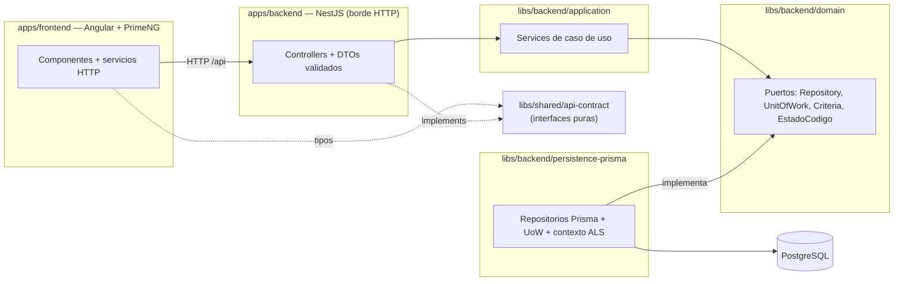

# Inventory System

Sistema de gestión de inventario multi-dominio para una organización real: administra
**artículos** (equipamiento con nº de serie), **agrupadores** (conjuntos/contenedores con
jerarquía), **lotes de consumibles**, **empleados/áreas** y las **asignaciones** de todo eso
a las personas. Cada **dominio de inventario** (Informática, EPP, Librería…) define sus
propios tipos de agrupador y **atributos dinámicos** de artículo — sin tocar código.

> 📐 Las decisiones de arquitectura están documentadas como **[ADRs](./docs/decisions/)**:
> qué se decidió, qué alternativas se descartaron y qué costos se asumieron.

## Qué lo hace interesante

- **Dominios dinámicos**: el administrador crea dominios con identidad visual propia
  (icono + color), tipos de agrupador y atributos de artículo en runtime. La UI genera las
  pantallas y columnas a partir de esa configuración ([ADR-0007](./docs/decisions/ADR-0007-workspace-del-dominio.md)).
- **Atributos por dominio sin EAV**: valores en **JSONB** (`Articulo.atributos`) con índice
  GIN + un catálogo (`AtributoDefinicion`) que arma los formularios y valida
  ([ADR-0004 D1](./docs/decisions/ADR-0004-modelo-de-datos.md)).
- **Contención ≠ asignación**: estar *dentro de* un agrupador es independiente de estar
  *entregado a* una persona. Un locker (contenedor) agrupa pero no se asigna; un kit sí.
  Configurable por tipo (`TipoAgrupador.asignable`) y validado en el server ([ADR-0004 D2/D3](./docs/decisions/ADR-0004-modelo-de-datos.md)).
- **Operaciones de stock atómicas** expresadas como métodos de puerto con intención
  (`descontarStock` = `UPDATE … WHERE disponible >= cantidad`), sin lost-updates y sin
  filtrar el ORM a la capa de aplicación.
- **Transacciones sin estado compartido**: Unit of Work stateless con
  `AsyncLocalStorage` — los repositorios resuelven el cliente activo (transacción o base)
  desde el contexto, seguro bajo concurrencia ([ADR-0005](./docs/decisions/ADR-0005-acceso-a-datos-unificado.md)).
- **Contrato REST compartido**: interfaces puras en `libs/shared/api-contract` consumidas
  por el front (tipos) y el back (DTOs `implements` + `class-validator`): si el contrato
  cambia, el backend **no compila** hasta ajustarse ([ADR-0002](./docs/decisions/ADR-0002-contrato-rest-compartido.md), [ADR-0006](./docs/decisions/ADR-0006-validacion-y-dtos-en-backend.md)).
- **Límites de arquitectura que se hacen cumplir**: `@nx/enforce-module-boundaries` con tags
  por capa — la dependencia prohibida no pasa el lint.

## Arquitectura



- La capa de aplicación **sólo conoce los puertos** del dominio; Prisma vive detrás de la
  indirección de persistencia ([ADR-0001](./docs/decisions/ADR-0001-arquitectura-por-capas.md)).
- Invariantes de negocio garantizadas por **un único escritor** en el caso de uso (ej. el
  estado denormalizado del agrupador) + **índices únicos parciales** en Postgres
  ("asignación activa única").

## Estructura

```
apps/
  backend/                    → borde HTTP: controllers, DTOs (class-validator), wiring
  frontend/                   → SPA Angular 21 + PrimeNG (design system propio)
libs/
  shared/api-contract/        → contrato REST compartido (interfaces puras, sin frameworks)
  backend/domain/             → puertos + Criteria + códigos de dominio (sin NestJS/Prisma)
  backend/application/        → services de caso de uso (testeados con fakes in-memory)
  backend/persistence-prisma/ → adaptadores Prisma, UnitOfWork, contexto de transacción
prisma/                       → schema, migraciones y seed
docs/decisions/               → ADRs (el "por qué" de cada decisión)
```

## Arranque

Requisitos: Node 20+, PostgreSQL 14+ (local o Docker).

```sh
# 1. Base de datos (si no tenés una local)
docker run -d --name inventory-pg -e POSTGRES_PASSWORD=postgres -p 5432:5432 postgres:16

# 2. Configuración
cp .env.example .env            # ajustar DATABASE_URL si hace falta

# 3. Instalar, migrar y sembrar
npm install
npx prisma migrate dev          # crea el schema
node prisma/seed.js             # estados de referencia + usuario admin

# 4. Levantar
npx nx serve backend            # API en http://localhost:3000/api
npx nx serve frontend           # SPA en http://localhost:4200
```

Login: legajo **`admin`** (auth "blanda" — ver nota de seguridad).

## Tests

```sh
npm test        # vitest — unitarios de las capas de aplicación y persistencia
```

La suite testea las **reglas de negocio** de los services de aplicación contra los puertos
del dominio usando **fakes in-memory** — sin NestJS, sin Prisma y sin base de datos. Eso es
deliberado: es la demostración de que la indirección de persistencia paga. Cobertura actual:

| Área | Qué se prueba |
|------|---------------|
| Asignaciones | Rechazos por estado/contención, tipo no asignable, estado denormalizado con único escritor, sin cascada a sub-agrupadores, entregas de consumibles con stock insuficiente |
| Agrupadores | Contención pura (no toca el estado), auto-referencia y **detección de ciclos** en la jerarquía |
| Inventario | Cambio de estado por código estable validado, edición con traducción de errores de unicidad, stock atómico (falla sin efectos) |
| Catálogos | Patch parcial que no pisa campos ausentes, derivación de códigos estables, defaults de tipos |
| Persistencia | Regresión de concurrencia del Unit of Work (AsyncLocalStorage): transacciones concurrentes aisladas y reentrancia |

## Documentación

- **[ADRs](./docs/decisions/)** — decisiones de arquitectura, con alternativas y costos.
- **[REVISION.md](./REVISION.md)** — el diagnóstico técnico inicial que motivó el rediseño.

## Nota de seguridad

⚠️ La API **no tiene autenticación real** — decisión consciente y documentada para un
sistema interno protegido a nivel de red ([ADR-0003](./docs/decisions/ADR-0003-autenticacion-diferida.md)).
**No exponer a internet.**
