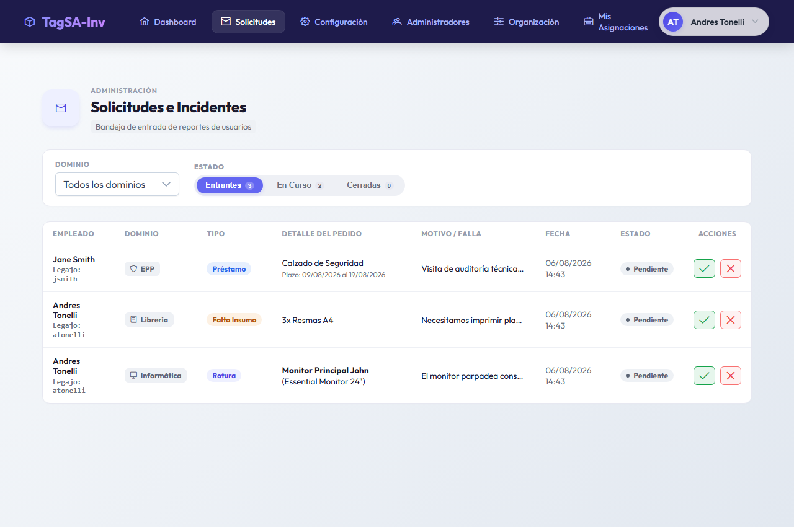
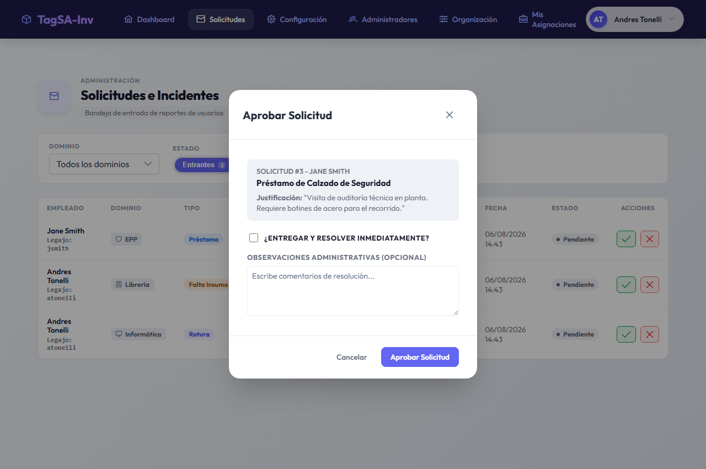

# Manual de Usuario para Administradores
## Sistema de Gestión de Inventario y Solicitudes

Este manual describe el funcionamiento del panel de administración de solicitudes e incidentes y detalla cómo gestionar los pedidos realizados por los colaboradores.

---

## 1. Acceso a la Bandeja de Administración
Para acceder a la bandeja de gestión de solicitudes, debes estar registrado como administrador (de Dominio o de Sistema):

1. Inicia sesión con tus credenciales.
2. En la barra de navegación superior o lateral, haz clic en **Solicitudes** (esta opción solo es visible si tu rol es administrativo).
3. Accederás al panel en `http://localhost:4200/solicitudes`.

---

## 2. Indicadores de Gestión y Filtros
El panel administrativo te brinda indicadores rápidos sobre el estado de la gestión:
- Tarjetas superiores con el conteo de solicitudes **Pendientes**, **En Curso** e **Historial (Resueltas/Rechazadas)**.
- **Filtro de Dominio**: Si eres Administrador del Sistema, puedes alternar entre todos los dominios o ver solo un dominio específico. Las solicitudes generales sin dominio figurarán bajo la categoría **"Soporte General"**.
- **Filtro de Estado**: Permite filtrar entre solicitudes pendientes y resueltas/cerradas.

---

## 3. Resolución de Solicitudes e Incidentes
Para gestionar cualquier ticket pendiente, localiza el registro en la tabla y presiona el botón **Resolver** en la columna de acciones. Se abrirá un modal interactivo con opciones específicas para cada flujo:

### A. Solicitud de Faltantes de Insumos (ESCASEZ)
1. Al hacer clic en **Resolver**, visualizarás el detalle y la justificación.
2. Si deseas rechazarla, ingresa la justificación y haz clic en **Rechazar**.
3. Si deseas iniciar la compra, haz clic en **Aprobar Solicitud**. Esto cambiará el estado de la solicitud a **En Curso**.
4. **Entrega y Cierre**: Si ya dispones del insumo y se lo entregas al colaborador en el momento:
   - Tilda el casillero: **"Marcar como entregado y resolver ahora"**.
   - Haz clic en **Aprobar Solicitud**. La solicitud se cerrará inmediatamente en estado **Resuelta/Entregada**.

### B. Reportes de Rotura de Equipos (ROTURA)
1. Al hacer clic en **Resolver**, verás el artículo afectado y el detalle del daño.
2. **Aprobar la reparación**: Al hacer clic en **Aprobar**, la solicitud pasa a **En Curso**. El sistema te pedirá asociar el nuevo estado temporal del artículo (ej. En Servicio Técnico, En Reparación).
3. **Cierre de la Reparación**: Una vez reparado el equipo o resuelto el inconveniente:
   - Puedes tildar el casillero **"Marcar reparación como resuelta"**.
   - Selecciona el estado de retorno del equipo (ej. Excelente, Bueno).
   - Haz clic en **Aprobar Solicitud**. El artículo volverá a estar asignado activamente al colaborador de forma automática y el ticket se cerrará en estado **Resuelta**.

### C. Préstamos Temporales (TEMPORAL)
1. Revisa las fechas solicitadas.
2. Al aprobar, el ticket quedará **En Curso** hasta la fecha de entrega del equipo.
3. Se puede registrar la entrega y devolución del bien directamente en el modal presionando las casillas correspondientes para actualizar el inventario físico en tiempo real.

### D. Solicitudes de Soporte General y Mantenimiento (GENERAL)
1. Verás el concepto redactado por el colaborador (ej. "Luz rota en oficina").
2. Estos tickets son resueltos de forma exclusiva por **Administradores del Sistema**.
3. Al hacer clic en **Aprobar**, puedes ingresar observaciones administrativas (ej. "Derivado al electricista el día 06/08").
4. Puedes tildar **"Marcar soporte general como resuelto"** para cerrar la solicitud inmediatamente o dejarla **En Curso** hasta que el servicio técnico finalice las tareas.
