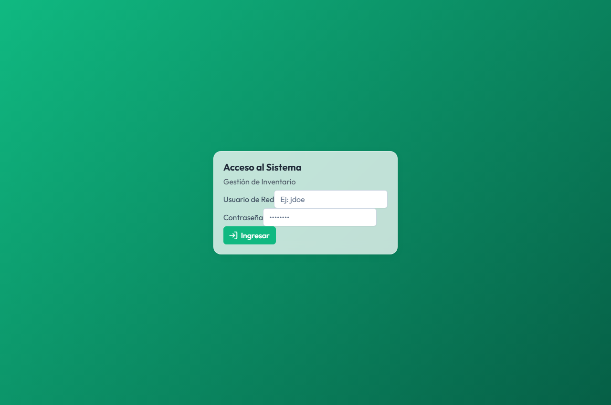
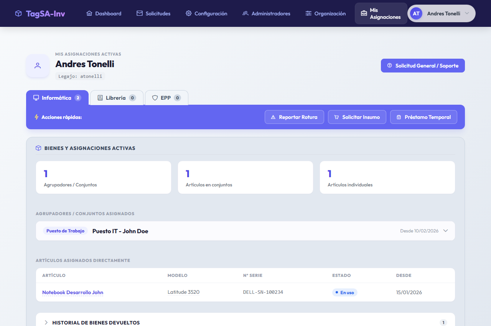
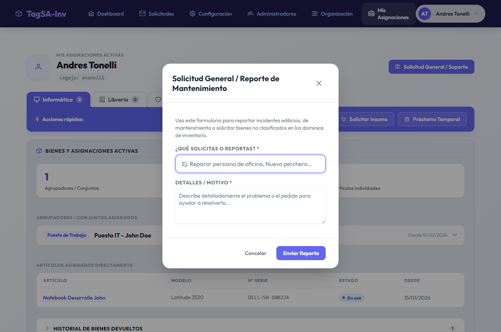

# Manual de Usuario para Colaboradores
## Sistema de Gestión de Inventario y Solicitudes

Este manual describe el funcionamiento del panel de colaboradores y explica paso a paso cómo visualizar tus bienes asignados, consultar tu historial y realizar solicitudes generales o reportes de incidentes.

---

## 1. Acceso al Sistema
El acceso al sistema está unificado con las credenciales de red (Active Directory / LDAP).

1. Ingresa a la URL de la aplicación: `http://localhost:4200/`
2. En la pantalla de inicio de sesión, introduce tu **Legajo** (usuario de red) y tu **Contraseña**.
3. Haz clic en **Ingresar**.

---

## 2. Visualización de Bienes y Asignaciones Activas
Una vez dentro del sistema, accederás a la vista **Mis Asignaciones**, que organiza tus pertenencias según su Dominio (ej. Notebooks, Celulares, etc.) usando un diseño intuitivo de **solapas de carpeta**:

- **Selección de Dominio (Menú de Solapas)**: En la parte superior verás solapas con los nombres e iconos de cada dominio. Haz clic sobre cualquiera para filtrar las asignaciones y acciones de ese dominio.
- **Doble Fondo Estructural**: 
  - La sección superior (tarjeta de color gris/pizarra `#e2e8f0`) contiene tus bienes activos.
  - La sección inferior (tarjeta de color lavanda `#ede9fe`) contiene tus solicitudes y reportes.

### Consultar Conjuntos (Agrupadores) y Artículos
Dentro del bloque gris superior podrás:
- Ver estadísticas rápidas (total de conjuntos y artículos).
- Desplegar conjuntos (**Agrupadores**) haciendo clic sobre su cabecera para ver los componentes vinculados (ej. Mouse, Cargador, etc.).
- Listar artículos asignados de forma directa en la tabla inferior.

---

## 3. Historial de Bienes Devueltos
Para no ocupar espacio innecesario, el historial se encuentra colapsado de forma predeterminada dentro del contenedor gris de inventario.

- Haz clic sobre la cabecera **Historial de bienes devueltos** (marcada con una flecha `>`).
- El panel se desplegará revelando la tabla histórica de todas tus devoluciones en el dominio seleccionado (con fechas de entrega, devolución y observaciones asociadas).

---

## 4. Acciones Rápidas (Solicitudes de Dominio)
La barra de acciones rápidas (índigo) está directamente unida al menú de solapas. Te permite crear solicitudes específicas para el dominio activo:

### A. Reportar Rotura (Incidentes)
1. Haz clic en **Reportar Rotura**.
2. Selecciona el artículo dañado de la lista desplegable (solo se listarán tus bienes del dominio activo).
3. Describe el motivo o detalle del daño (ej. "La pantalla parpadea").
4. Haz clic en **Enviar Reporte**.

### B. Solicitar Insumo (Falta de Stock)
1. Haz clic en **Solicitar Insumo**.
2. Selecciona la categoría de insumos necesaria y especifica la cantidad.
3. Escribe una breve justificación del pedido.
4. Presiona **Enviar Solicitud**.

### C. Préstamo Temporal
1. Haz clic en **Préstamo Temporal**.
2. Selecciona la categoría y define la **Fecha de Inicio** y la **Fecha de Fin** del préstamo.
3. Completa los motivos y presiona **Enviar Solicitud**.

---

## 5. Mantenimiento y Soporte General (Sin Dominio)
Si necesitas reportar un incidente edilicio (ej. inodoro roto, cerrajería) o solicitar un bien que no está clasificado en los dominios habituales, utiliza la bandeja de soporte:

1. Haz clic en el botón superior derecho: **"Solicitud General / Soporte"**.
2. Completa el campo **Concepto / Reporte** (ej. "Inodoro roto en 2do piso").
3. Detalla el motivo o justificación de soporte.
4. Haz clic en **Enviar Solicitud**.
5. Podrás realizar el seguimiento de estos tickets al pie de la página, en la sección **Mantenimiento y Soporte General** (bloque lavanda).

